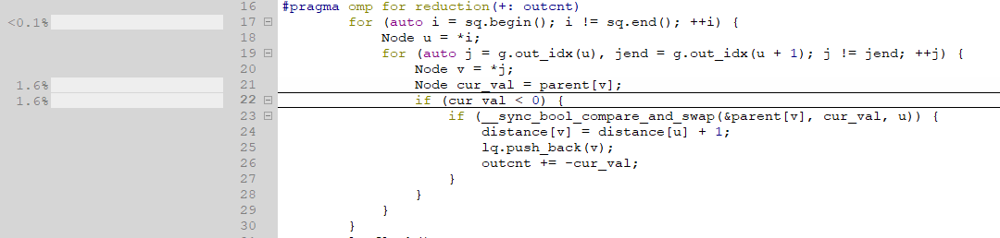
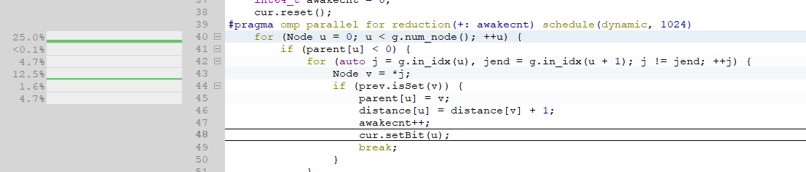
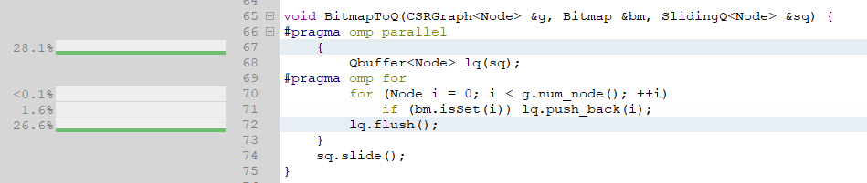
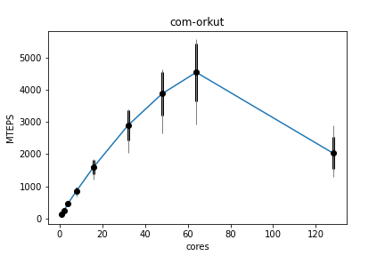
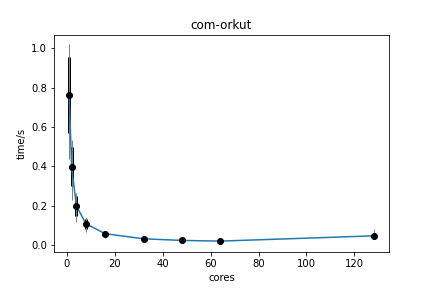

# CS121 Parallel Computing Lab 1 Breadth First Search using OpenMP


## Configuration

| Config   | Value                                                        |
| -------- | ------------------------------------------------------------ |
| CPU      | AMD EPYC 7742 64-Core Processor @ 3246MHz (64 Cores / 64 Threads) * 2 |
| L1 cache | 4MiB                                                         |
| L2 cache | 32MiB                                                        |
| L3 cache | 256MiB                                                       |
| Memory   | 1TiB errordetection=multi-bit-ecc                            |
| Distro   | Ubuntu 20.04.3 TLS                                           |
| Kernel   | 5.4.0-90-generic                                             |
| Compiler | GCC10.3.0                                                    |
| Opt      | -O3                                                          |
| OpenMP   | libomp 5.0                                                   |

## Algorithm and Difficulty

In the lab, I tried to use two kind of algorithm to parallelize the BFS from two prospective.

### Task Distribution without the Queue

One big reason why BFS is a little hard to be parallelized is that we always need a queue to save the next node to be expanded. And pushing and popping a ordinary queue atomic operation which introduce large overhead for parallel problem. So I firstly researched for data structure without lock. A paper "A Work-Efficient Parallel Breadth-First Search Algorithm"[^1] introduces **Bag**[^2] which using a group of binary tree to store the neighbor nodes separately by each threads and join into a large *bag* and the *split* it into small bags to distribute the tasks to threads recursively. Which seems a very efficient way. But actually after developed a version of ***Bag BFS*** based on `OpenCilk/applications`[^3], and `nducthang/BFSParallel`[^4], I met such a large problem that I give up this strategy. When ***splitting*** the large next layer bag, I used `omp task` to create threads recursively, `omp` introduced a large overhead when creating new threads. Which is an unsolvable for `openmp`. And some commits has been mentioned that ` Cilk++ examples usually show the efficiency of using deep function recursions, which is probably not the bottleneck for most programs.`[^5]. This is may be caused by the implementation of these two lib is different on creating new threads for **task** not **parallel for**.

Seeing that the result is even worse than the serial one, so I just put a result of my program on the `web-stanford` test case. And `omp task` is even not been implemented by `gcc`.

```
n: 281904 m: 2312497
read in successfully
parallel: 0.0974251 MTEPS= 0.000554272
serially: 1.291e-05 MTEPS= 4.1828
parallel: 0.129251 MTEPS= 15.3172
serially: 0.0516386 MTEPS= 38.1506
parallel: 0.0895561 MTEPS= 22.1275
serially: 0.0420165 MTEPS= 46.8875
parallel: 0.0919143 MTEPS= 21.5774
serially: 0.0414357 MTEPS= 47.5447
parallel: 0.0019746 MTEPS= 0.304366
serially: 5.7799e-05 MTEPS= 10.2943
parallel: 0.0924518 MTEPS= 21.4052
serially: 0.0420056 MTEPS= 46.8995
parallel: 0.00135271 MTEPS= 0.101278
serially: 2.242e-05 MTEPS= 5.97681
```

### Memory Locality

An other problem I met is how to save and read the map. I firstly deploy an improved version of **Adjacency Table** called **Chained Adjacency Table** to store the graph, by 3 arrays including one chained table to indicate the next neighbor which cost a little memory. And the program get a low cache hit rate, because the iteration of edges is not adjacent. So I use **Compressed Sparse Row** to solve the problem and get a high memory locality.

### Top-Down and Bottom-Up BFS and Hybrid BFS[^6]

Top-Down BFS is just like the normal BFS by just iterate the queue and put the expanded nodes in an other queue and replace the old queue with the new queue after the iteration. And Bottom-Up BFS is just iterating every nodes' parents check whether they are visited. Both two BFS algorithm have worse cases and they make up for each other's shortcomings. I deployed Hybrid BFS referencing the author's[^7]. And the we can hybrid two method by watching the explored edges can get a better performance.

### Optimization

#### bitmap

When Bottom-Up BFS, we need a structure to record the visited nodes as fast as possible. So an atomic bitmap is fast and small enough for the task.

```c++
    void setBitAtomic(int n) {
        uint64_t curVal, newVal;
        do {
            curVal = start_[arrIdx(n)];
            newVal = curVal | ((uint64_t) 1l << bitIdx(n));
        } while (!__sync_bool_compare_and_swap(&start_[arrIdx(n)], curVal, newVal));
    }
```

### OMP Tuning





When iterating, parallel for may introduce low memory locality because the thread get the `parent[v]` very frequently, so by `schedule(dynamic, 128)` and tuning the chunk size we can get a better locality.

## benchmark





These are sample results, for more result you can find in `out-final` about the plot and rawdata.

### build and running

```bash

cd pbfs
mkdir release
cd release
cmake .. -DCMAKE_BUILD_TYPE=Release
make
./pbfs /home/geekpie/data/web-Stanford.in  4  #run without output
./pbfs /home/geekpie/data/web-Stanford.in  4 /home/murez/result/ #run with out put dir
# I can get you help with running and build
```

>I have discussed with Jing Haotian, Chen Meng.

[^1]:["A Work-Efficient Parallel Breadth-First Search Algorithm"](https://citeseerx.ist.psu.edu/viewdoc/download?doi=10.1.1.572.2838&rep=rep1&type=pdf) Charles E. Leiserson Tao B. Schardl
[^2]: [Slide for "A Work-Efficient Parallel Breadth-First Search Algorithm"](http://web.mit.edu/neboat/www/presentations/spaa2010.pdf)
[^3]: [OpenCilk/application/bfs_bench](https://github.com/OpenCilk/applications)
[^4]:[nducthang/BFSParallel](https://github.com/nducthang/BFSParallel)
[^5]: [commits](https://forum.openmp.org/viewtopic.php?t=450)
[^6]: [Distributed Memory Breadth-First Search Revisited: Enabling Bottom-Up Search](https://crd.lbl.gov/assets/pubs_presos/mtaapbottomup2D.pdf)
[^7]: [sbeamer/gapbs](https://github.com/sbeamer/gapbs)

